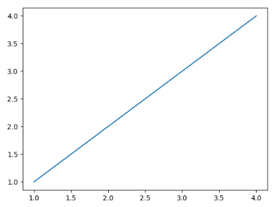

## New project python for the first time with Pycharm and Anaconda!!

- start.py is the simple print out String and Array
- rowAndColumn.py is the simple to get the input as X and Y, X present as Row and Y present as Column. The value is start with 0 and +1... until Y as a Column, multiple value in the row until reach the X value
    
    Example: X and Y = 3,3
    
    Output: 
        
        [0, 0, 0]
        [0, 1, 2]
        [0, 2, 4]

- graph.py is graph generator by using matplot
    
    Example: plt.plot([1,2,3,4], [1,2,3,4])
    
    Output: 
  
    